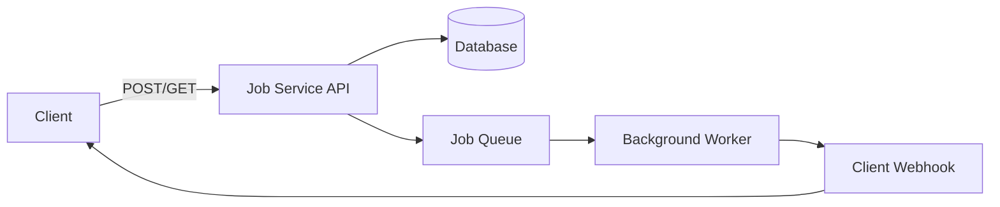

# 🏗️ Component Diagram

## Overview

המערכת מורכבת מחמישה רכיבים עיקריים:

1. **Client App** – הלקוח שיוצר את הג׳ובים ומקבל חיווי על סטטוס.
2. **Job Service API** – נקודת כניסה של כל בקשות ה־HTTP (POST /jobs, GET /jobs/{jobId}).
3. **Database (DB)** – מאחסן רשומות `Jobs` (וגם `Attempts` אופציונלית).
4. **Job Queue** – תור שמנהל את הג׳ובים הממתינים לעיבוד על ידי Workers.
5. **Background Worker** – עיבוד הג׳ובים ברקע ושליחת Webhooks.
6. **Webhook** – נקודת סיום חיצונית אצל הלקוח, שמקבלת הודעות על סיום/כישלון.

---

## Mermaid Component Diagram

---

## 🔍 רכיבים – הסבר קצר

* **Client App**

  * שולח בקשות ל־API.
  * מקבל חיווי דרך Webhook או Polling (`GET /jobs/{jobId}`).

* **Job Service API**

  * אחראי על:

    * בדיקות Idempotency
    * כתיבה ל־DB
    * הכנסת משימות ל־Queue
    * החזרת תשובות HTTP

* **Database**

  * שומר רשומות `Jobs` (סטטוס, PayloadHash, Idempotency-Key, timestamps).
  * תומך ב־Indexes: `(tenantId, status)`, `(nextRunAt)`, `UNIQUE(tenantId, idempotencyKey)`.

* **Job Queue**

  * מנהל את כל הג׳ובים שממתינים לעיבוד.
  * מבטיח שה־Worker יקבל את המשימות לפי סדר והזמינות.

* **Background Worker**

  * מקבל ג׳ובים מה־Queue.
  * מבצע את העבודה ברקע (email, SMS וכו׳).
  * מנהל Retry עם Backoff (30s → 60s → 120s).
  * שולח Webhook על הצלחה או כישלון.

* **Webhook**

  * נקודת קצה חיצונית של הלקוח.
  * מקבלת POST עם JobId, Status, Attempts ו־Payload.
  * Client מחזיר `200 OK`.
  * נכשל → Worker מבצע Retry עד 3 פעמים → DLQ אם נכשל כל הניסיונות.

