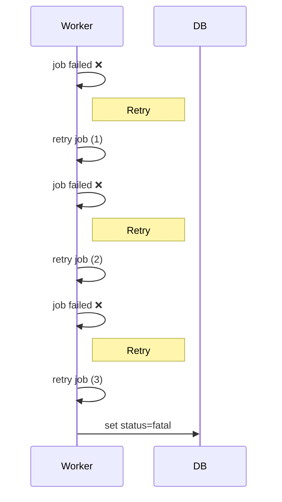
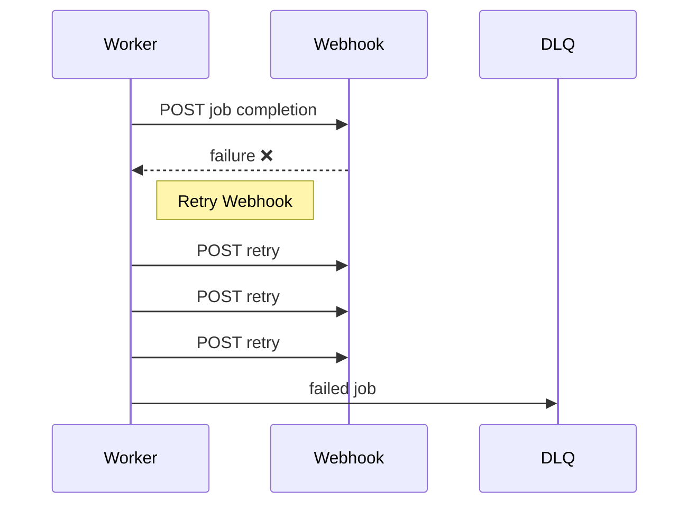

# 🔁 Retry Mechanism & Backoff

מערכת הג׳ובים תומכת ב־**Retry חכם** לכל משימה ול־Webhook, עם Backoff מדורג כדי למנוע עומס על Workers או Webhook endpoints.

---

## 1. Job Retry (Background Worker)

* **Max attempts:** 3
* **Backoff schedule:**

  | Attempt | Wait time |
  | ------- | --------- |
  | 1       | 30s       |
  | 2       | 60s       |
  | 3       | 120s      |
* **Idempotency:**

  * כל ניסיון הוא **idempotent**, כלומר חזרה על ניסיון לא תגרום ל־double-processing.
  * Status מתעדכן ב־DB (`queued → running → retry → succeeded/fatal`).

**Flow Example:**

---

## 2. Webhook Retry

* **Max attempts:** 3
* **Backoff schedule:** 30s → 60s → 120s
* **Failure handling:**

  * אם כל הניסיונות נכשלו → Job נשלח ל־DLQ (Dead Letter Queue).
  * Alerts נשלחים למפעילים אם DLQ מלא >5 דקות.

**Flow Example:**

---

## 3. Notes & Best Practices

* **Backoff values configurable** – ניתן לשנות לפי עומס או SLA.
* **Observability:**

  * כל Retry מתועד בלוגים עם `tenantId`, `jobId`, `attempt number`, `nextRunAt`.
  * Metrics: Retry rate, Failed jobs, DLQ size.
* **Idempotency guarantees:**

  * כל Retry חייב להיות בטוח ולא ליצור כפילויות (במיוחד חשוב ל־Webhook).

---
